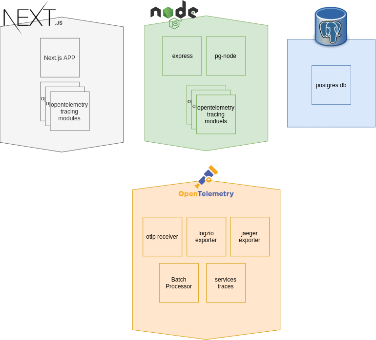
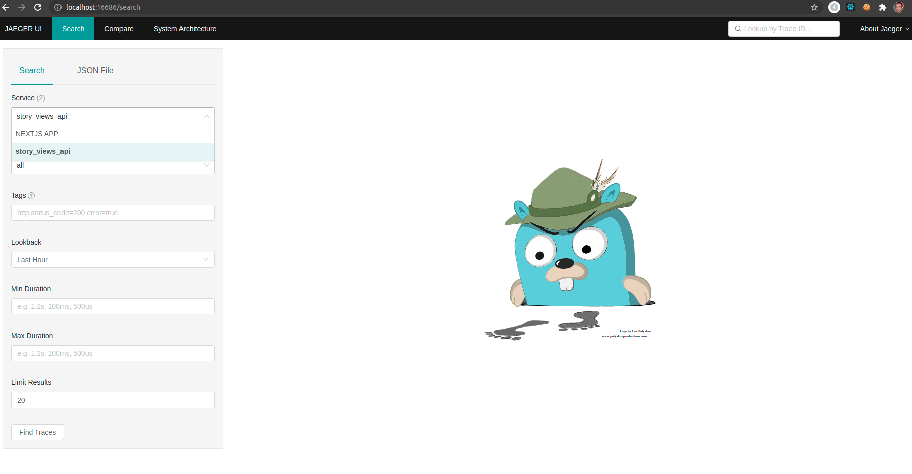
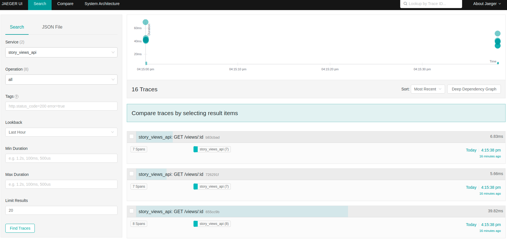
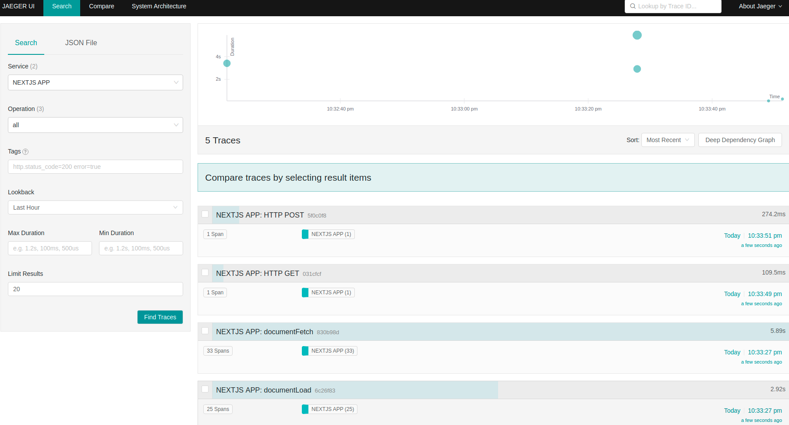
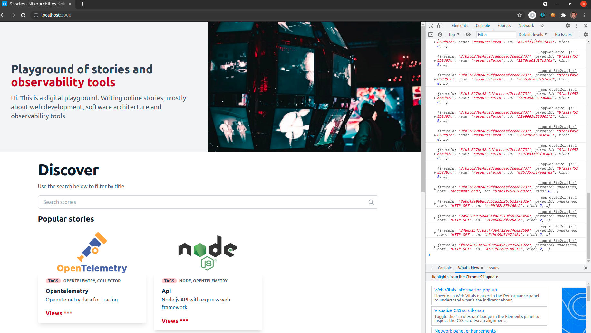

# Fullstack Observability with Opentelementry Playground

## Opentelemetry in Javascript (Javascript in Browsers and Node.js)



This is a `Fullstack` playground of Opentelemetry in Javascript, `Javascript in Browsers` and `Node.js`

The playgound is made with :sparkling_heart: in order to `learn` and `do`.

### Setup

The setup process consists of three phases

1. getting opentelemetry collector configured, then
2. using docker-compose to build, compose and run the components of frontend, api, postgres, opentelemetry collector in the same network. Then,
3. validating to ensure that tracing data is being sent as expected.
4. Stopping containers and learn to plan next actions

#### 1. Configuring opentelemetry collector

The Collector configuration is located [here](./observability/collector/collector-config.example.yaml)

`Only` tracing is configured for telemetry at the moment.  
But feel free to adjust the configuration to your needs, then

`Rename` the configuration file to `collector-config.yml`

#### 2. Composing with Docker

Have Docker installed on your machine.

Composing, building and running, the `docker-compose` file
defines in a `declerative way` the containers that should be builded,
in which order builded, and run in the same `network`.

The docker-compose file is located [here](./docker-compose.yml)

Command: `docker-compose up --build`

You should see similar to this in your terminal.  
The `State` should have a value of `Up` indicating that the components are up and running

```zsh
           Name                          Command               State                                        Ports
------------------------------------------------------------------------------------------------------------------------------------------------------
stories_api_1                 docker-entrypoint.sh npm r ...   Up      0.0.0.0:5000->5000/tcp,:::5000->5000/tcp
stories_collector_1           /otelcontribcol --config=/ ...   Up      55679/tcp, 55680/tcp, 0.0.0.0:55681->55681/tcp,:::55681->55681/tcp
stories_frontend_1            docker-entrypoint.sh yarn  ...   Up      0.0.0.0:3000->3000/tcp,:::3000->3000/tcp
stories_jaeger-all-in-one_1   /go/bin/all-in-one-linux         Up      0.0.0.0:49154->14250/tcp,:::49154->14250/tcp,
                                                                       0.0.0.0:49153->14268/tcp,:::49153->14268/tcp,
                                                                       0.0.0.0:16686->16686/tcp,:::16686->16686/tcp, 5775/udp, 5778/tcp, 6831/udp,
                                                                       6832/udp
stories_postgres_1            docker-entrypoint.sh postgres    Up      5432/tcp
```

#### 3. Validating collected telemetry data for tracing

Jaeger tracing data

Command:  
Open `http://localhost:16686`
You should see similar to this, in the service tab the services with the name `story_views_api` and `NEXTJS APP`



Command:  
Select `story_views_api` and hit on `find traces`.  
You should see similar to this:



Command:  
Select `NEXTJS APP` and hit on `find traces`.  
You should see similar to this:



Frontend tracing data in the browser console

Command:  
Open `http://localhost:3000` in your browser and  
Open `Web developer tools`, `console` tab.

You should see similar to this:



#### 4. Stopping containers

Command:  
`docker-compose down` , then  
you should see similar to this, indicating that the containers are stopped:

```bash
Stopping stories_frontend_1          ... done
Stopping stories_api_1               ... done
Stopping stories_postgres_1          ... done
Stopping stories_collector_1         ... done
Stopping stories_jaeger-all-in-one_1 ... done
Removing stories_frontend_1          ... done
Removing stories_api_1               ... done
Removing stories_postgres_1          ... done
Removing stories_collector_1         ... done
Removing stories_jaeger-all-in-one_1 ... done
Removing network stories_default
```

### Composition

#### Api

Node.js version lts --latest  
This is the api created with express as web application framework,
node-postgres for interfacing with your PostgreSQL database
and  
uses [opentelemetry/node](https://github.com/open-telemetry/opentelemetry-js/tree/main/packages/opentelemetry-node)

Api is accessible at `http://localhost:5000/` , saying `Hi`  
See documentation here for details: [api](./frontend/data/stories/api.mdx)

#### Postgres Database

Postgres version --latest
This is the database for persisiting information of `views`
On build a table `STORY_VIEWS` is created

```sql
CREATE TABLE STORY_VIEWS (
  id VARCHAR(50) PRIMARY KEY,
  views INT
);
```

See documentation here for details: [postgres](./frontend/data/stories/postgres.mdx)

#### Frontend

Next.js version 11.0.1  
This is the frontend application created with Nextjs , mdx-remote , tailwind
and  
uses [opentelemetry/web](https://github.com/open-telemetry/opentelemetry-js/tree/main/packages/opentelemetry-web)

Frontend is accessible at `http://localhost:3000/`

See documentation here for details: [frontend](./frontend/data/stories/frontend.mdx)

#### Observability Components

##### Collector

version of Collector: otel/opentelemetry-collector-contrib:0.17.0

As described in the [Opentelemetry Documentation](https://opentelemetry.io/docs/concepts/components/)  
The OpenTelemetry Collector offers a vendor-agnostic implementation on how to receive, process, and export telemetry data. It removes the need to run, operate, and maintain multiple agents/collectors in order to support open-source observability data formats (e.g. Jaeger, Prometheus, etc.) sending to one or more open-source or commercial back-ends. The Collector is the default location instrumentation libraries export their telemetry data.

`Only` tracing is configured for telemetry at the moment.
The Collector configuration is located [here](./observability/collector/collector-config.example.yaml)

```yml
# define receivers, eg. otlp with supported protocols grpc, http
receivers:
  otlp:
    protocols:
      grpc:
      http:
        # USE FOR CORS
        # cors_allowed_origins:
        #   - http://*
        #   - https://*

# define exporters, eg. jaeger
# if you use logzio, define logzio
exporters:
  jaeger:
    endpoint: jaeger-all-in-one:14250
    insecure: true
  # setup a logzio account and get a logzio tracing token
  logzio:
    account_token: "your-token"
    region: "your-region"

# define span processors
processors:
  batch:

# define services and pipelines for traces
service:
  pipelines:
    traces:
      receivers: [otlp]
      processors: [batch]
      exporters: [jaeger]
      # OR use as exporters in case you have a logzio account
      # exporters: [jaeger,logzio]
```

See documentation here for details: [opentemetry](./frontend/data/stories/opentelemetry.mdx)

##### Jaeger

Jaeger for tracing  
version of Jaeger: jaegertracing/all-in-one:latest
Jaeger is accessible at: http://localhost:16686/

See documentation here for details: [opentemetry](./frontend/data/stories/opentelemetry.mdx)

##### Logzio

`Logzio` for tracing additionally to local `Jaeger`.  
Start a free trial at [Logz.io](https://logz.io/freetrial/)

Why Logzio ?

With `Logz.io` you can have the best-of-breed open source monitoring tools on a `fully managed` cloud service.  
One unified SaaS platform to collect and analyze logs, metrics, and traces, plus human-powered AI/ML features to improve troubleshooting, reduce response time and help you manage costs.

- Log Management  
  Based on ELK

- Infrastructure Monitoring  
  Based on Prometheus

- Distributed Tracing  
  Based on Jeager

See documentation here for details: [opentemetry](./frontend/data/stories/opentelemetry.mdx)

## Known warnings

1. Opentelemetry for Javascript in Browsers

investigate on opentelemetry repo what impact the following warning has:

```
warning "@opentelemetry/auto-instrumentations-web > @opentelemetry/instrumentation-user-interaction@0.22.0" has unmet peer dependency "zone.js@0.11.4"
```

Because of the warning i do not use `ZoneContextManager` as `commented on code` [here](./frontend/lib/useOpentemetry.js#L11)

## Todo(s)

- learn more about openetelemetry/web
- learn more about propagators

## Actions

As you have noticed the Nextjs Web App in this playground generates the documentations as static prerendered pages  
with the usage of `mdx`.

By navigating the path `localhost:3000/stories/<story-name>` you can  
see the detailed documentation of each component (`api`, `frontend`, `opentelemetry`, `postgres`, `setup`)

Try this out: `localhost:3000/stories/api` and see ... the results

Complete the documentation with `interactive examples`

1. [api](./frontend/data/stories/api.mdx)
2. [frontend](stories/frontend/data/stories/frontend.mdx)
3. [opentelemetry](./frontend/data/stories/opemtelemetry.mdx)
4. [postgres](./frontend/data/stories/postgres.mdx)
5. [setup](./frontend/data/stories/setup.mdx)
